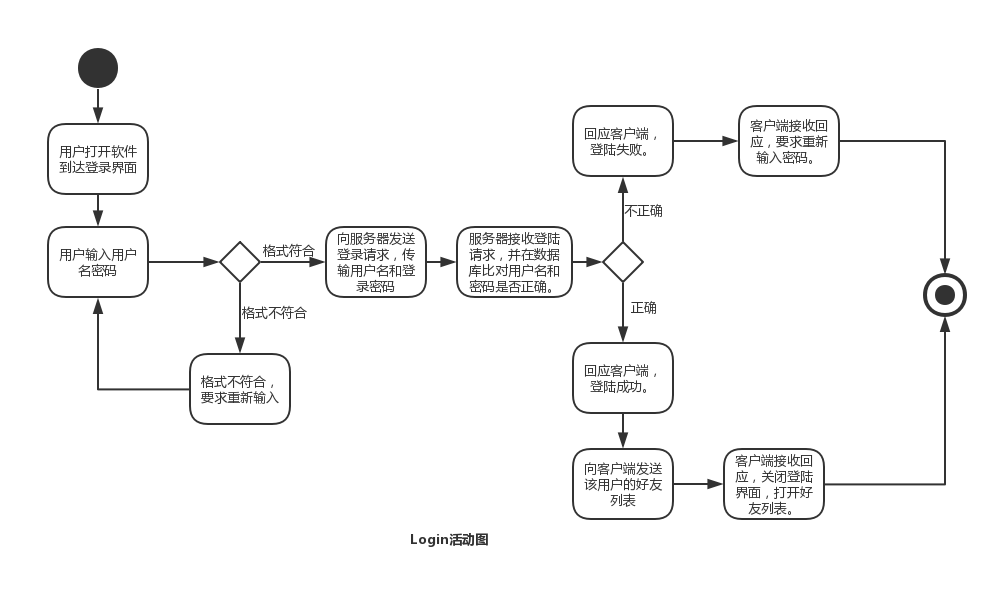
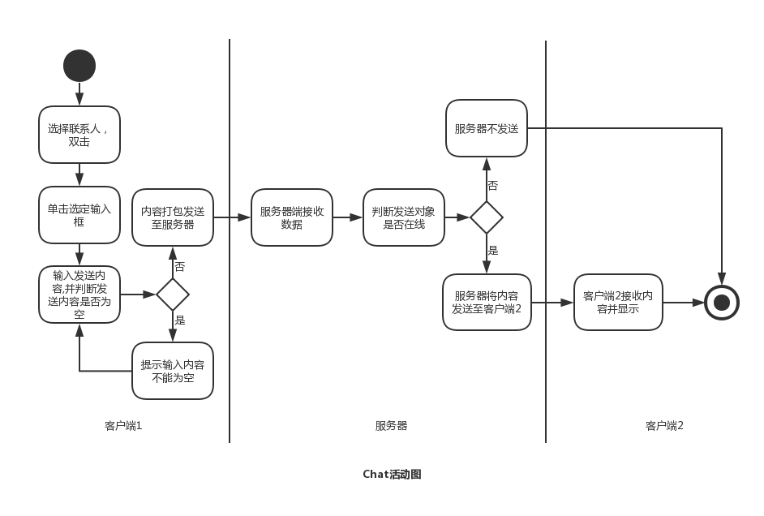
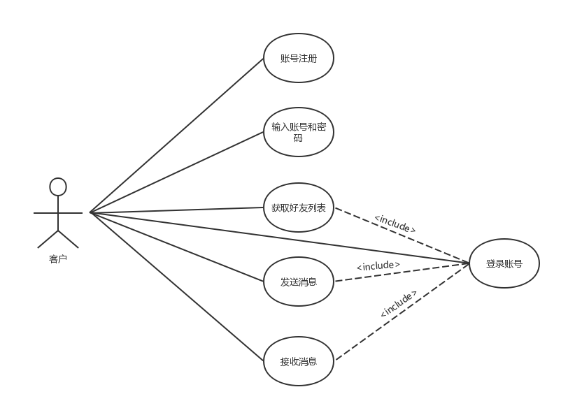
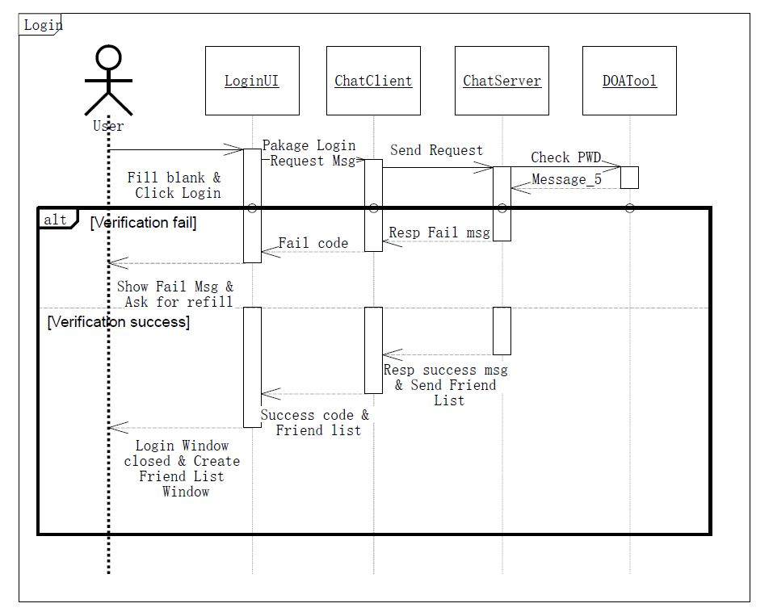

# ChatRoom项目需求文档_初始版本

## 0  绪言

### 0.1  关于本文

本需求文档为软件工程ChatRoom项目初始版本的需求文档。供软件工程小组组员参阅。

- 修改历史

  d1026: 刘年 创建编写文档

  d1119: 添加完图

### 0.2  术语

- client/server结构

  > 主从式架构 (Client–server model) 或客户端-服务器（Client/Server）结构简称C/S结构，是一种网络架构，它把客户端 (Client) （通常是一个采用图形用户界面的程序）与服务器 (Server) 区分开来。每一个客户端软件的实例都可以向一个服务器或应用程序服务器发出请求。有很多不同类型的服务器，例如文件服务器、游戏服务器等。

- socket

  > 网络上的两个程序通过一个双向的通信连接实现数据的交换，这个连接的一端称为一个socket。

  ​

## 1  项目概述

本项目为软件工程课程项目。

### 1.1  系统功能简述

本项目初始版本预期实现一个包括以下功能的聊天程序。

1. 客户可以输入账号和密码登录。
2. 客户可以获取当前账户的好友列表。
3. 客户可以通过服务器转发实现一对一聊天。

### 1.2  项目开发环境/运行环境/使用技术 

-   开发环境

    Java SE Development Kit 8

-   运行环境

                          Java(TM) SE Runtime Environment(JVM)

-   使用技术

    - 用户界面：JAVA Swing
    - 系统结构：Client/Server
    - 通信：JAVA Socket

## 2  详细需求

### 2.1  项目用户需求定义

- 系统提供的服务

  初始版本系统提供的服务主要分为客户端与服务器端

  - 客户端
    - 连接服务器：能够连接服务器，并通过输入输出流通信。
    - 登陆功能：建立与服务器的连接并登陆，能显示登陆错误信息。
    - 好友列表：能够根据服务器发回数据，显示好友列表。
    - 在线好友聊天：能够与在线的好友聊天。
  - 服务器端
    - 接受客户端：能够接受客户端，并通过输入输出流通信。
    - 能够处理客户端的登陆请求。
    - 能够给客户端发送好友列表。
    - 能够支持客户端与另一个在线客户端聊天。

- 非功能需求

  - 产品需求

    该聊天程序必须保持稳定，在系统正常的情况下不会出现意外崩溃或无法响应的情况。

### 2.2  系统需求描述

#### 2.2.1  客户端功能需求

| 功能   | 连接服务器                             |
| :--- | :-------------------------------- |
| 描述   | 客户端连接服务器，确认服务器可以连接。               |
| 输入   | 读取类中的ServerIP和port。               |
| 动作   | 根据ServerIP和port，开启Socket，获取输入输出流。 |
| 输出   | 能否连接到服务器                          |

| 功能   | 登陆服务器                                  |
| ---- | -------------------------------------- |
| 描述   | 客户端申请登陆，确认用户密码是否正确。                    |
| 输入   | 用户输入的userid和password                   |
| 动作   | 将userid和password根据通讯协议传输到服务器，并接收服务器回信。 |
| 输出   | 用户名密码是否正确                              |
| 相关   | 通讯协议                                   |

| 功能   | 获取好友列表                    |
| ---- | ------------------------- |
| 描述   | 完成登陆后，从服务器获取好友列表，并显示出好友界面 |
| 动作   | 从服务器获取好友列表，并通过给好友列表界面对象。  |
| 相关   | 通讯协议，好友列表界面对象             |

| 功能   | 一对一聊天                          |
| ---- | ------------------------------ |
| 描述   | 在好友列表中点击一个好友，开始一对一聊天，可以发送/接收信息 |
| 动作   | 根据通讯协议，向指定用户发送信息               |
| 输入   | 发送的目标userid以及发送内容（聊天界面传入）      |
| 动作   | 根据通讯协议，读取信息来源用户，通过聊天界面显示内容。    |
| 输出   | 聊天内容传给聊天界面对象                   |
| 相关   | 通讯协议，聊天界面对象                    |

#### 2.2.2  服务器功能需求

| 功能   | 创建服务器           |
| ---- | --------------- |
| 描述   | 创建服务器。          |
| 动作   | 根据指定的port创建服务器。 |
| 输入   | port(端口)        |

| 功能   | 接受Client                          |
| ---- | --------------------------------- |
| 描述   | 接受客户端，创建单独线程，并通过输入输出流通信。          |
| 动作   | 循环监听是否有client接入，若有，则创建单独线程对其进行操作。 |
| 相关   | 服务器服务线程，ServerThread              |

| 功能   | 响应登陆请求&发送好友列表                   |
| ---- | ------------------------------- |
| 描述   | 响应客户端发送的登陆请求。                   |
| 输入   | 根据输入流中读取的数据以及通讯协议，读取userid和pwd。 |
| 行动   | 利用数据库查询输入的userid和pwd是否匹配        |
| 输出   | 根据通讯协议，向输出流输出回执信息，包含最终匹配结果。     |
| 行动   | 若登陆信息匹配，更新用户在线表。                |
| 输出   | 若登陆信息匹配，则再根据通讯协议，向输出流发送好友列表。    |
| 相关   | 数据库，通讯协议                        |

| 功能   | 一对一聊天                               |
| ---- | ----------------------------------- |
| 描述   | 响应客户端的聊天请求，并将聊天信息发到指定客户端。           |
| 输入   | 根据输入流中读取的数据以及通讯协议，获取目标userid以及发送内容。 |
| 行动   | 根据目标userid以及发送内容，给对应客户端发送信息。        |
| 输出   | 通过寻找对应客户端所接入的thread，给对应客户端发送内容。     |
| 相关   | 通讯协议，serverthread                   |

### 2.3 系统模型

#### 2.3.1 活动图

> 绘图者：蔡春波

- Login活动

  

- Chat活动

  

#### 2.3.2 用例图

> 完成者：杨红

#### 2.3.3 时序图

> 绘制者：刘年

#### 2.3.4 类图

#### 2.3.5 数据流图

### 2.4 通讯协议

|    type    |  值   |            描述             |        类         |
| :--------: | :--: | :-----------------------: | :--------------: |
|  1.注册请求信息  | 0x01 |      客户发送注册请求数据给服务器       |      MsgReg      |
|  2.注册应答消息  | 0x11 |         客户端返回注册结果         |    MsgRegResp    |
|  3.登陆请求信息  | 0x02 |       客户端发送包括JK号及密码       |     MsgLogin     |
|  4.登录应答消息  | 0x22 |         服务器返回登录结果         |   MsgLoginResp   |
|  5.添加好友信息  | 0x05 | 客户端向服务器发送添加好友JK号和添加好友所在列表 |   MsgAddFriend   |
| 6.添加好友应答信息 | 0x55 |        服务器返回添加好友结果        | MsgAddFriendResp |
|   7.好友列表   | 0x03 |      服务器给用户发送好友列表信息       |   MsgTeamList    |
|   8.聊天信息   | 0x04 |     客户端给服务器/服务器给客户端消息     |   MsgChatText    |

#### 2.4.1 消息头（MsgHead）

|   MsgHead    |  消息头（13）   |        消息体         |
| :----------: | :--------: | :----------------: |
| int totalLen |  消息总长度（4）  |                    |
|  byte type   |  消息类型（1）   |                    |
|   int desk   |  目标JK号（4）  | 服务器的JK号：2000000000 |
|   int src    | 发送用户JK号（4） | 登录发送JK号：2000000001 |

#### 2.4.2 注册消息体（MsgReg extends MsgHead）

|      成员属性       |      类型      | 长度（总长33） |      |
| :-------------: | :----------: | :------: | :--: |
| String nikeName | Octet String |    10    |  昵称  |
|   String Pwd    | Octet String |    10    |  密码  |

#### 2.4.3 注册应答消息（MsgRegResp）

|    成员属性    |  类型  | 长度（总长14） |                                     |
| :--------: | :--: | :------: | :---------------------------------: |
| byte state | byte |    1     | 若state为0.desk为目标JK号；若state为1（或其它）错误 |

#### 2.4.4 登录请求信息（MsgLogin）

|    成员属性    |      类型      | 长度（总长23） |              |
| :--------: | :----------: | :------: | :----------: |
| String pwd | Octet String |    10    | 密码JK号保存到src中 |

#### 2.4.5 登录应答信息（MsgLoginResp） 

|    成员属性    |  类型  | 长度（14） |                                        |
| :--------: | :--: | :----: | :------------------------------------: |
| byte state | byte |   1    | 若为0：登录成功；若为1：JK/pwd错误；若为2：ip错误；其它：未知错误 |

#### 2.4.6 添加好友信息 （MsgAddFriend）

|       成员属性       |      类型      | 长度（27） |              |
| :--------------: | :----------: | :----: | :----------: |
|    int add_ID    |     int      |   4    |  所添加好友的JK号   |
| String list_name | Octet String |   10   | 添加好友至好友列表的名称 |

#### 2.4.7 添加好友应答信息 （MsgAddFriendResp）

|    成员属性    |  类型  | 长度（14） |                                          |
| :--------: | :--: | :----: | :--------------------------------------: |
| byte state | byte |   1    | 若为0：添加好友成功；若为1：不存在该用户；若为2：已经存在该好友；若为3：创建好友列表失败 |

#### 2.4.8 好友列表信息（MsgTeamList）

|      成员属性       |      类型      | 长度（总长：利用计算长度） |              |
| :-------------: | :----------: | :-----------: | :----------: |
| String UserName | Octet String |      10       |     用户名字     |
|   int UserPic   |     int      |       4       |     用户头像     |
| byte listCount  |     byte     |       1       | 好友分组个数，表示有几组 |
| String listName | Octet String |      10       |     分组名称     |
| byte bodyCount  |     byte     |       1       |   本组有多少个用户   |
|   int bodyPic   |     int      |       4       |     好友头像     |
|   int bodyNum   |     int      |       4       |    好友的JK号    |
| String nikeName | Octet String |      10       |      好友      |
| byte bodyState  |     byte     |       1       |  好友状态，0：在线   |

#### 2.4.9 聊天信息（MsgChatText）

|      成员属性      |      类型      |  长度  |        |
| :------------: | :----------: | :--: | :----: |
| String msgText | Octet String |  13  | 可聊天的内容 |

## 附录

