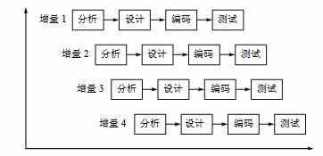

# 软件工程大作业

## 更新记录

- d1025 软件工程项目准备开始

## 项目要求

**模拟QQ聊天程序**

- 功能要求

  1. 登录功能。
  2. 客户可以通过服务器转发，实现一对一和多对多聊天。
  3. 实现呼叫功能。
  4. 客户端程序应该可以实时显示目前其它用户的状态。
  5. 保存并能察看聊天纪录。
  6. 申请新的用户号码。
  7. 易用、美观的图形界面，实现系统托盘。

- 服务器及客户端的功能：

  - 客户端：

    1. 登陆功能：建立与服务器的连接并登陆，能显示登陆错误信息。
    2. 界面显示：将在线好友显示在好友列表中，并实现系统托盘，加入工具栏便于操作。
    3. 聊天功能：与好友聊天。
    4. 聊天纪录：能保存聊天纪录，并能察看聊天纪录。
    5. 信息提示：闪动托盘图标提示到来信息，并播放不同音乐来提示。
    6. 其他：用户登陆成功，将保存其号码，以便下次登陆时，不必再输入而可以直接选择，显示登陆时间。

  - 服务器端：

    1. 向各个客户端发布系统消息。
    2. 接受来自客户端的各种信息并分别处理。
    3. 登陆信息：检查登陆信息是否正确，并向客户端返回登陆信息，如信息正确。就将在线用户发给该用户，并将该用户的状态发给各在线用户。同时在服务器端显示出来。
    4. 聊天信息：转发给消息指定的用户。
    5. 申请信息：自动分配8位用户号码，并保存该用户，同时将信息返回给客户端。
    6. 用户下线：将此用户下线消息发给各客户端，并改写用户在服务器端的状态。

    ​

    > 组长：刘年
    >
    > 组员：黄成越，杨红，蔡春波

## 项目采用模型

​	本项目采用增量式开发。

​	

## 采用该模型分析

> 开始日期:2016-10-25

> 预定完成时间:2016-10-29

> 结束日期:

> 完成者:杨红

包括优势、符合该需求的特性、基本项目流程图

###增量模型的优势
1.降低了适应用户需求变更的成本。重新分析和修改文档的工作量少了很多。
2.在开发过程中更容易得到用户对于已做的开发工作的反馈意见。
3.能够更快地交付和部署简单的聊天程序软件。

###符合的特性
1.对于我们要开发的聊天程序软件，其步骤大概是先开发一个初始版本，再根据测试提出意见和建议，再改进版本。
2.聊天程序软件的描述、开发和有效性验证等活动交织在一起，我们需要快速地传递其反馈信息。
3.聊天程序软件具有复杂的用户界面，功能也较复杂，所以可以进化式地开发该软件。
4.当需要增加功能时，只需要开发新增量即可，对已有的几乎不需要进行修改。
5.用户可以对当前软件版本进行评估并提出相关意见，还能直观地看到当前开发进度。
6.可以非常快速地交付简单的聊天程序软件，然后在此基础上添加新增量，最后得到一个功能完整且强大且复杂的聊天程序软件。

## 概要描述

> 开始日期:2016-10-25

> 预定完成时间:2016-10-29

> 结束日期:

> 完成者:黄成越

包括整个系统要实现哪些功能

这些功能可以分哪些阶段，模块

# 增量开发记录

## 初始版本设计

> 开始日期:

> 预定完成时间:2016-11-3

> 结束日期:

### 需求分析

> 完成者:刘年

### 系统设计

> 完成者:刘年、蔡春波

### 编码

> 完成者:刘年

### 测试

>完成者:全员测试

